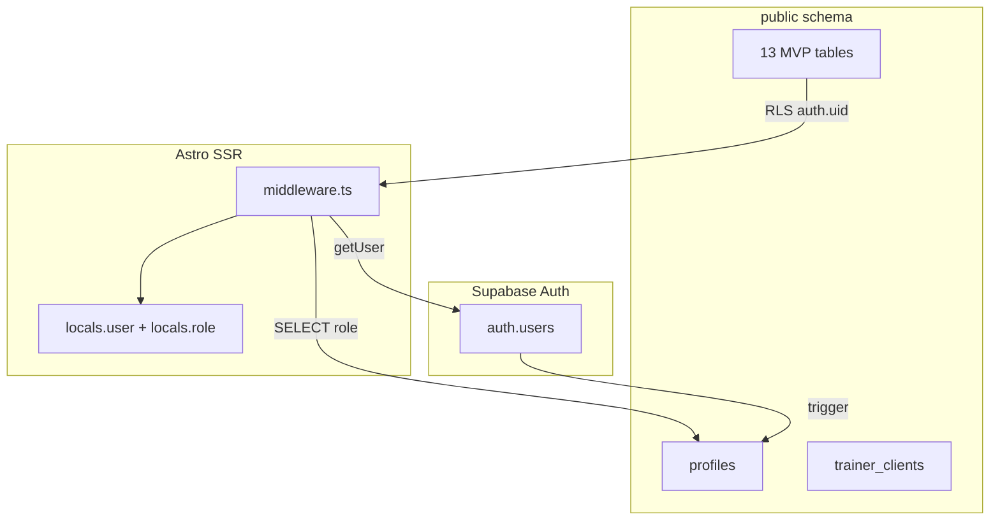

# F-01 database schema, RLS, and role-aware middleware — Plan Brief

> Full plan: `context/changes/database-schema-and-rls/plan.md`
> Research: (none — planning used codebase exploration + `docs/ERD.md`)

## What & Why

trAInR’s product data lives entirely in Postgres, but the repo today has **auth only** — no migrations, no `profiles`, no RLS. F-01 lays the foundation slice from the roadmap: all **13 MVP tables** from `docs/ERD.md`, cross-tenant isolation via RLS, and middleware that exposes each user’s **role** (`trainer` | `client`) so every downstream slice (S-01–S-13) can build on a secure, typed base.

## Starting Point

- Supabase SSR client and cookie sessions work (`src/lib/supabase.ts`, `src/middleware.ts`).
- Auth API routes call `signUp` / `signInWithPassword` only — no profile rows.
- `docs/ERD.md` is the schema source of truth; `supabase/migrations/` does not exist yet.
- `supabase/config.toml` references missing `seed.sql`; CI does not apply migrations.

## Desired End State

After F-01, `supabase db reset` locally creates the full MVP schema with RLS enabled on every table, `muscle_groups` seeded, and a trigger that provisions `profiles` on signup (default **trainer**). Hosted Supabase receives the same schema via documented `supabase db push`. Middleware attaches `locals.role` from `profiles` and guards `/dashboard`, `/trainer/*`, and `/client/*` by authentication and role. `src/types.ts` mirrors ERD MVP interfaces for implementers.

## Key Decisions Made

| Decision                | Choice                                                  | Why (1 sentence)                                                                    | Source |
| ----------------------- | ------------------------------------------------------- | ----------------------------------------------------------------------------------- | ------ |
| Schema scope            | All 13 MVP tables + T2/T3 columns                       | Avoid schema churn when S-09/S-10/S-13 add app code; lock rules stubbed until then. | Plan   |
| Migration split         | 4–5 domain-ordered SQL files                            | Reviewable chunks following FK dependency order.                                    | Plan   |
| Profile creation        | `SECURITY DEFINER` trigger on `auth.users`              | Covers email signup and future OAuth without duplicating API logic.                 | Plan   |
| Default role            | `trainer` on public signup; `client` via invite in S-03 | Matches PRD onboarding model.                                                       | Plan   |
| `muscle_groups` data    | `supabase/seed.sql`                                     | Matches existing `config.toml`; keeps reference data out of migrations.             | Plan   |
| `invite_links` RLS      | Trainer CRUD only in F-01                               | Minimal surface; S-03 adds validation UX/RPC.                                       | Plan   |
| `locked_at` / edit seal | Column present; enforcement deferred to S-13            | Schema stable without building lock logic before logging exists.                    | Plan   |
| RLS structure           | STABLE SQL helper functions                             | DRY isolation checks across 13 tables; auditable in one place.                      | Plan   |
| `context.locals`        | `role: UserRole \| null` only                           | One profile query per request; enough for guards and layouts.                       | Plan   |
| Route protection        | `/dashboard` + `/trainer/*` + `/client/*`               | Forward-compatible with slice routes; role mismatch redirects.                      | Plan   |
| TypeScript types        | Hand-written `src/types.ts` from ERD                    | Matches AGENTS.md; no codegen step in F-01.                                         | Plan   |
| Remote deploy           | Manual `supabase db push` + doc checklist               | No new CI secrets; matches current pipeline.                                        | Plan   |

## Scope

**In scope:**

- Five migrations: profiles/helpers → onboarding → exercises → templates/plans → sessions/logging/comments
- RLS on all MVP tables; helper functions for trainer–client isolation
- `seed.sql` for `muscle_groups`
- Trigger + default trainer role; metadata hook documented for S-03 client invites
- `src/types.ts`, `src/env.d.ts`, middleware role + route guards
- `prerender = false` on auth API routes; config/docs fixes

**Out of scope:**

- Post-MVP tables (`goals`, `subscriptions`, etc.)
- Invite registration UI, anon token RPC, Google OAuth (S-03 / later)
- T3 `locked_at` UPDATE denial on `set_logs`
- App CRUD pages (S-01+)
- CI migration automation
- Generated Supabase types

## Architecture / Approach

Migrations establish tables and policies; the app never bypasses RLS (anon key only). Middleware is the sole per-request profile read for role routing.

## Phases at a Glance

| Phase                   | What it delivers                                         | Key risk                                            |
| ----------------------- | -------------------------------------------------------- | --------------------------------------------------- |
| 1. Profiles & helpers   | Enums, `profiles`, trigger, SQL helpers, profiles RLS    | Trigger/metadata mistakes block all signups         |
| 2. Onboarding & library | `trainer_clients`, `invite_links`, exercises stack, seed | Missing seed breaks FK demos                        |
| 3. Templates & plans    | Templates, `client_plans`, partial unique index          | Active-plan constraint wrong → data model bug       |
| 4. Sessions & logging   | Remaining tables, full RLS audit                         | Policy gaps → cross-tenant leak                     |
| 5. App & verification   | Types, middleware, docs, manual push                     | Forgotten remote `db push` leaves prod on auth-only |

**Prerequisites:** Docker for `npx supabase start`; `.env` with `SUPABASE_URL` / `SUPABASE_KEY`; linked remote project for push (optional until deploy).

**Estimated effort:** ~2–3 focused sessions across 5 phases.

## Open Risks & Assumptions

- **S-03 dependency:** Client role assignment is not E2E-testable until invite registration ships; F-01 documents `raw_user_meta_data.role = 'client'` contract for that slice.
- **Route prefixes:** `/trainer/*` and `/client/*` may 404 until slices add pages; guards still run to prevent wrong-role access.
- **Muscle catalog:** Seed list must be agreed (standard human anatomy set); can expand without migration.
- **config.toml** `site_url` (3000) vs Astro dev port (4321) must be aligned for local auth redirects.

## Success Criteria (Summary)

- `supabase db reset` succeeds; all 13 tables exist with RLS enabled.
- Trainer A cannot SELECT trainer B’s exercises (manual SQL or Studio test).
- New signup creates `profiles` row with `role = trainer`.
- Middleware sets `locals.role` for authenticated requests; wrong role on `/trainer/*` or `/client/*` is redirected.
- `npm run lint` and `npm run build` pass after app changes.
