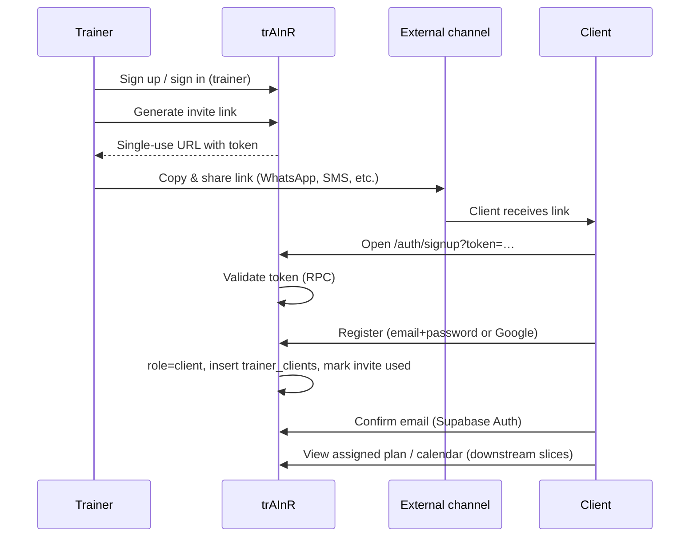

# Research: Client onboarding flow — copy link vs send email

**Date**: 2026-05-30  
**Researcher**: Auto  
**Git Commit**: `bcd3ed8d81beabc99f25554e86e71a89492945fb`  
**Branch**: `m2l4`  
**Repository**: trAInR

## Research Question

How should we handle client onboarding, what should be the flow? Should we allow the trainer to copy a referral link from somewhere on the page? Should we allow sending an email to a client address via UI from the trainer? If we continue with email, how would we send those emails — via what library?

**Scope (user-selected):** Detailed analysis; UX & flow primary; full comparison of copy-link-only vs copy+email vs email-only onboarding.

## Summary

**Recommended MVP flow (S-03): invite link + copy-to-clipboard.** This matches the locked PRD/shape decision: the trainer generates a single-use link, copies it, and shares it through whatever channel they already use (WhatsApp, SMS, in-person). The client opens `/auth/signup?token=…`, registers with `role: client`, and is auto-assigned via `trainer_clients`. No transactional email send is required for MVP.

**Copy link on the page: yes — this is the core trainer UX for S-03.** Place it on a trainer-only surface (e.g. `/trainer/clients` → “Invite client”) with a generated URL, a **Copy link** button, and optional status (unused / used / expired). Add shadcn `input` + toast (`sonner`) — neither exists yet; only `button` is installed today.

**Send invite email from trainer UI: no for MVP.** PRD Non-Goal #5 explicitly parks “notifications (email/push)” post-MVP. FR-003 Socrates note already accepted that invite links add an external sharing step. Treat “Send to email” as a **post-MVP enhancement** layered on the same link-generation backend.

**If email is added later:** use **[Resend](https://resend.com/docs/send-with-astro)** (`npm install resend`) from an Astro API route (`POST /api/invites/send`) on Vercel. Do **not** conflate this with Supabase Auth’s built-in confirmation emails — those are a separate SMTP configuration (Resend as custom SMTP in Supabase Dashboard is still recommended for production auth mail). Implementation reference: [resend-docs.md](./resend-docs.md) (Context7).

| Mode | MVP? | Fits PRD? | Complexity |
|------|------|-----------|------------|
| **Copy link only** | Yes (S-03) | Yes — FR-003/004 | Low — no email infra |
| **Copy + optional “Send email”** | Post-MVP | Compatible extension | Medium — Resend + domain verify + API route |
| **Email-only (trainer enters client email, system invites)** | No | Rejected for MVP; “future alternative” per PRD | High — different UX, deliverability, bounce handling |

## Detailed Findings

### Current implementation status

**Foundation exists; application layer not started.**

| Layer | Status | Evidence |
|-------|--------|----------|
| `invite_links` + `trainer_clients` tables + RLS | Done (F-01) | `supabase/migrations/20260526120100_trainer_onboarding.sql` |
| Profile role from signup metadata | Done — defaults `trainer` | `handle_new_user()` in `20260526120000_enums_profiles_helpers.sql:77-93` |
| Trainer signup API | Done — hardcodes `role: "trainer"` | `src/pages/api/auth/signup.ts:15-21` |
| Middleware role guards | Done — `/trainer/*`, `/client/*` prefixes | `src/middleware.ts:6-49` |
| Invite generation UI/API | **Missing** | No `/api/invites`, no trainer pages |
| Token validation RPC | **Deferred to S-03** | Migration comment line 38 |
| Client signup via token | **Missing** | `SignUpForm.tsx` has no token field |
| Email libraries in `package.json` | **None** | No resend/nodemailer/sendgrid |

Roadmap marks S-03 as **proposed** (`context/foundation/roadmap.md:110-120`).

### PRD-mandated onboarding flow (step by step)



1. Trainer signs up (email+password; Google optional per FR-001 fast-follow guidance).
2. Trainer generates an **invite link** for a new client (FR-003).
3. Client registers via the link; **auto-assigned** to that trainer (FR-004).
4. Client can log in/out (FR-005).
5. Downstream (S-04+): trainer assigns sessions; client sees calendar and logs workouts (US-01).

**US-01 acceptance:** “Invite link leads to a registration page; client is auto-assigned to the trainer on completion” — `context/foundation/prd.md:59-60`.

**Unauthenticated access:** Invite URLs are the exception — they lead to registration, not a gated app shell — `context/foundation/prd.md:169`.

### UX recommendation: where copy-link lives

**Primary surface:** `/trainer/clients` (or a “Clients” section on trainer dashboard once S-07 exists; for S-03, a minimal dedicated page is enough).

**Trainer “Invite client” panel:**

1. **Headline:** “Invite a client”
2. **Primary action:** “Generate invite link” → `POST /api/invites` creates `invite_links` row with cryptographically random token, optional `expires_at` (recommend 7 days default; PRD asks for expiry/usage limits but doesn’t specify duration).
3. **Result state:**
   - Read-only URL field: `https://<app>/auth/signup?token=<token>`
   - **Copy link** button (clipboard API + toast “Link copied”)
   - Helper text: “Send this link to your client via WhatsApp, text, or email. Each link works once.”
4. **Optional list:** Recent invites (unused / used / expired) from `invite_links` where `trainer_id = auth.uid()`.

**Why copy-link is enough for MVP:** Independent trainers already coordinate with clients outside the app. The product hypothesis (shape-notes) assumes async coaching over existing channels. Forcing in-app email adds domain verification, bounce handling, and support burden before the core loop is proven.

**Client registration page (`/auth/signup?token=…`):**

- Server-side: call `validate_invite_token(token)` RPC before rendering form; show friendly error if invalid/expired/used.
- Differentiate copy from trainer signup: “Create your client account” + trainer name if RPC returns it.
- Hidden field carries token through to `POST /api/auth/signup`.
- After success → existing `/auth/confirm-email` flow (Supabase Auth confirmation).

**Recommended URL pattern:** `/auth/signup?token=<url-safe-token>` — reuses existing signup route; matches existing `?error=` query pattern on auth pages (`src/pages/auth/signup.astro:5`).

Alternative cleaner URL `/invite/<token>` is valid but adds a page + redirect; not necessary for MVP.

### Should trainers send email from the UI?

**MVP: No.** Explicit non-goal:

> “**No notifications** — no email or push notifications. Post-MVP.” — `context/foundation/prd.md:177`

FR-003 already rejected email-based onboarding as the primary model:

> “Trainers might prefer to just add a client by email — invite links add a sharing step through an external channel.” Resolution: **invite link is the chosen onboarding model**. Direct email-based onboarding could be a **future alternative**.” — `context/foundation/prd.md:73-74`

**Post-MVP “Send invite” (optional enhancement):** Same generated link, plus a form field “Client email” and a secondary button “Send invite email”. Backend sends one transactional message with the link. This is **not** “email-only onboarding” (trainer still generates a link; email is just a delivery channel).

### Full comparison: copy-link vs copy+email vs email-only

| Dimension | Copy link only | Copy + send email | Email-only onboarding |
|-----------|----------------|-------------------|------------------------|
| **Trainer steps** | Generate → copy → paste in WhatsApp/SMS | Generate → copy *or* enter email → send | Enter client email → wait |
| **Client steps** | Open link → register | Same | Click email link → register (or magic link) |
| **PRD alignment** | Must-have (FR-003) | Extension; not required | Explicitly deferred |
| **Infra** | DB + RPC only | + Resend API key, domain DNS | + deliverability, bounces, “didn’t receive email?” support |
| **Privacy** | Trainer controls channel | App stores client email before account exists | App must handle invite to wrong address |
| **Leak risk** | Link can be forwarded | Same + email forwarding | Supabase admin invite or custom token in email |
| **Implementation** | S-03 scope | +1 API route, template, env secret | Different product flow; not planned |

**Recommendation:** Ship **copy link only** in S-03. Design the invite API so a future `sendEmail: true` flag can call the same link without schema changes.

### Technical design (S-03 delta)

**Database (new migration):**

- `validate_invite_token(p_token text)` → returns `{ valid, trainer_id, trainer_display_name, expires_at }` or error.
- `complete_client_invite(p_token text, p_client_id uuid)` → inserts `trainer_clients`, sets `invite_links.used_at` / `used_by_client_id`; enforces single-use (ERD Q5).

Use **`SECURITY DEFINER` RPC** — F-01 intentionally has **no anon RLS** on `invite_links` (`context/changes/database-schema-and-rls/plan.md:408-409`).

**API routes:**

| Route | Role | Purpose |
|-------|------|---------|
| `POST /api/invites` | Trainer | Create invite row, return full URL |
| `POST /api/auth/signup` | Anon | If `token` present: validate → `signUp({ data: { role: 'client' }})` → RPC assign |
| `POST /api/invites/send` | Trainer | **Post-MVP** — Resend transactional email |

**Signup metadata contract:** S-03 must pass `role: 'client'` in `raw_user_meta_data` — `context/changes/database-schema-and-rls/plan.md:64-65`. Current trainer signup hardcodes `trainer` (`src/pages/api/auth/signup.ts:19`).

**Post-login routing:** Extend signin to redirect by role (`/trainer/...` vs `/client/...`); today signin goes to `/` only.

### Email: two separate concerns

Do not merge these when planning:

| Concern | Who triggers | MVP? | How to send |
|---------|--------------|------|-------------|
| **Auth confirmation** (verify email on signup) | Supabase Auth automatically | Yes (existing flow) | Supabase built-in SMTP locally; **custom SMTP in production** |
| **Trainer-initiated invite email** (optional) | Trainer clicks “Send” | No (non-goal) | App-owned API route + transactional provider |

#### Auth emails (Supabase)

See [resend-docs.md](./resend-docs.md) for SMTP settings, Astro SDK patterns, and checklists.

Supabase’s default SMTP is for development only — rate limits, no SLA, cannot email non-org members in production ([Supabase Auth SMTP docs](https://supabase.com/docs/guides/auth/auth-smtp)). For production confirmation emails, configure **custom SMTP** in Supabase Dashboard → Authentication. **Resend** is listed in Supabase’s official supported providers and has a [Supabase integration guide](https://resend.com/docs/send-with-supabase):

- Host: `smtp.resend.com`, port `465`, user `resend`, password = API key
- After switching, raise Supabase’s default **30 emails/hour** auth rate limit

This covers “confirm your email” after client signup — **not** “here’s your invite link from your trainer.”

#### Transactional invite emails (post-MVP app feature)

If trainers can send invites from the UI, send from the **Astro SSR API layer on Vercel**, not from the browser:

```typescript
// Pattern: src/pages/api/invites/send.ts (post-MVP)
import type { APIRoute } from "astro";
import { Resend } from "resend";

export const prerender = false;

export const POST: APIRoute = async (context) => {
  const resend = new Resend(import.meta.env.RESEND_API_KEY);
  // validate session + trainer role, load invite URL
  const { data, error } = await resend.emails.send({
    from: "trAInR <invites@yourdomain.com>",
    to: clientEmail,
    subject: `${trainerName} invited you to trAInR`,
    html: `…`, // or React Email component
  });
  // return JSON error/success
};
```

**Recommended library: [Resend](https://resend.com/docs/send-with-astro)** (`resend` npm package).

| Provider | Why / why not for trAInR |
|----------|--------------------------|
| **Resend** | Best DX for Astro + Vercel + React 19; official Astro/Vercel docs; Vercel Marketplace integration; 3k emails/mo free tier; pairs with Supabase SMTP |
| **Postmark** | Excellent deliverability; only 100 emails/mo free — fine for tiny MVP but less headroom |
| **SendGrid** | Enterprise-grade; heavier setup; better if marketing + transactional at scale |
| **AWS SES** | Cheapest at volume; more ops (IAM, region, sandbox exit) |
| **Nodemailer** | Generic SMTP transport — use only if you must abstract over SMTP; adds indirection vs Resend SDK |
| **Supabase Edge Function + provider** | Valid pattern; unnecessary here since Astro API routes already run on Vercel |

Store `RESEND_API_KEY` in Vercel env (and `.env` locally). Verify sending domain in Resend before production.

**Resend reference:** [resend-docs.md](./resend-docs.md) — Context7 MCP (`/websites/resend`, `/resend/resend-examples`).

**Exa MCP note:** Exa was configured in `.cursor/mcp.json` but not connected in the original research session; email provider comparison used web research ([Resend Astro docs](https://resend.com/docs/send-with-astro), [Supabase SMTP guide](https://supabase.com/docs/guides/auth/auth-smtp), [provider comparison](https://codenote.net/en/posts/supabase-auth-custom-smtp-comparison/)).

### UI components needed

Current shadcn install is minimal (`button` only). For invite UX:

- `input` — read-only URL display
- `sonner` or `toast` — “Link copied” feedback
- Optional `card`, `badge` — invite status list

Existing patterns to reuse:

- Inline errors: `src/components/auth/ServerError.tsx`
- Form fields: `src/components/auth/FormField.tsx`
- Loading submit: `src/components/auth/SubmitButton.tsx`

## Code References

- `supabase/migrations/20260526120100_trainer_onboarding.sql:26-38` — `invite_links` schema; RPC deferred comment
- `supabase/migrations/20260526120000_enums_profiles_helpers.sql:77-117` — `handle_new_user` role resolution
- `src/pages/api/auth/signup.ts:15-21` — trainer-only signup; S-03 must branch on token
- `src/middleware.ts:6-49` — role-based route guards (pages not yet created)
- `src/types.ts:23-31` — `InviteLink` TypeScript interface
- `src/pages/auth/signup.astro:5` — existing query-param pattern for errors
- `docs/ERD.md:493-506` — single-use token decision (Q5)
- `context/foundation/prd.md:73-76,158,169,177` — invite model, access control, notifications non-goal
- `context/foundation/roadmap.md:110-120,271` — S-03 slice definition; notifications parked
- `context/changes/database-schema-and-rls/plan.md:47-48,64-65,408-409` — S-03 scope boundary and RPC guidance

## Architecture Insights

1. **Invite links are URLs, not emails** — MVP sharing is trainer-mediated through external channels; the app owns token lifecycle, not delivery.
2. **Security boundary at RPC** — Never expose `invite_links` to anon SELECT; validate/consume via `SECURITY DEFINER` functions.
3. **Single-use by design** — ERD Q5: set `used_at` on first successful registration; trainer generates one link per client.
4. **Role assignment is metadata + join table** — Trigger sets `profiles.role` from signup metadata; app/RPC creates `trainer_clients` row.
5. **Two email systems if you add send-from-UI** — Supabase Auth SMTP for confirmations; Resend API for trainer-initiated invites. Same provider (Resend) can serve both via SMTP + API key.

## Historical Context (from prior changes)

- `context/foundation/shape-notes.md:27-28,62,121-122` — Locked decision: invite link → registration → auto-assign; email onboarding as future alternative.
- `context/changes/database-schema-and-rls/plan-brief.md:28,52,99` — Default role trainer; client via invite in S-03; E2E not testable until S-03 ships.
- `context/changes/database-schema-and-rls/plan.md:47-48` — Explicit F-01 exclusion of invite registration UI and anon RPC.
- `docs/improved_idea_notes.md:11-12,77-79` — Same invite model; notifications explicitly post-MVP high priority.

## Related Research

- [resend-docs.md](./resend-docs.md) — Resend SDK, Astro/API route patterns, Supabase SMTP (Context7)
- `context/changes/database-schema-and-rls/plan.md` — Schema and RLS foundation for `invite_links` / `trainer_clients`
- `docs/ERD.md` — Entity relationships and open design decisions Q1–Q5

## Open Questions

1. **Default invite expiry** — PRD says expiry/usage limits but not duration. Recommend 7 days; confirm in `/10x-plan`.
2. **Google OAuth in S-03 vs fast-follow** — PRD keeps dual auth but Socrates suggests email+password first; invite flow with Google adds redirect/state complexity.
3. **Trainer name on client signup page** — RPC can return `display_name` for trust copy (“You’re joining {trainer}’s roster”).
4. **Rate limits on invite generation** — Prevent abuse (e.g. max N active unused links per trainer).
5. **When to add “Send email”** — Tie to post-MVP notifications slice or a dedicated “invite delivery” enhancement after S-07 proves retention.

## Recommendation Summary

| Question | Answer |
|----------|--------|
| **What flow?** | Trainer generates single-use link → client registers at `/auth/signup?token=…` → auto-assign → confirm email → client home |
| **Copy ref link on page?** | **Yes — required for S-03 MVP** |
| **Send email from trainer UI?** | **Not in MVP** (PRD non-goal); optional post-MVP on same link |
| **If email later, which library?** | **`resend`** npm package from Astro API route on Vercel; configure Resend SMTP separately for Supabase Auth confirmation emails |
