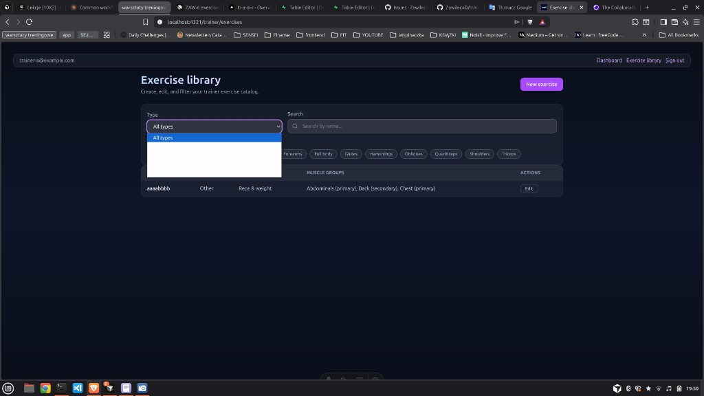

## Summary

Native select dropdowns on the exercise library use white/light option backgrounds while option text inherits `text-white` from the dark UI, making dropdown options unreadable.

## Steps to reproduce

1. Sign in as a trainer
2. Navigate to `/trainer/exercises`
3. Click the **Type** filter dropdown
4. Observe option text is white on a white/light background (only the highlighted row is legible)

## Expected vs actual

- **Expected**: Dropdown options are readable against the menu background on the dark theme
- **Actual**: Option text appears white on a white/light dropdown background; options are invisible except the highlighted item

## Workaround

none

## Local notes

Uses native `<select>` with `inputClass` (`text-white`, `bg-white/10`) in `ExerciseFilters.tsx` — browser-rendered option list does not inherit dark-theme colors. Same pattern likely affects selects in `ExerciseForm.tsx`.

## Screenshot

## GitHub snapshot

> Fetched 2026-05-29. Re-run `/github-issue-record 8` to refresh.

- **State**: open
- **Author**: ZawilecxD
- **Created / updated**: 2026-05-29T18:03:22Z
- **Labels**: bug
- **Assignees**: none

### Issue body

## Summary

Native select dropdowns on the exercise library use white/light option backgrounds while option text inherits `text-white` from the dark UI, making dropdown options unreadable.

## Steps to reproduce

1. Sign in as a trainer
2. Navigate to `/trainer/exercises`
3. Click the **Type** filter dropdown
4. Observe option text is white on a white/light background (only the highlighted row is legible)

## Expected vs actual

- **Expected**: Dropdown options are readable against the menu background on the dark theme
- **Actual**: Option text appears white on a white/light dropdown background; options are invisible except the highlighted item

## Affected area

`/trainer/exercises` · `ExerciseFilters.tsx` (Type filter select). Likely the same pattern in `ExerciseForm.tsx` native selects.

## Severity

medium

## Workaround

none

## Screenshot

See comment below — Type dropdown on `/trainer/exercises` showing white text on white dropdown background.
