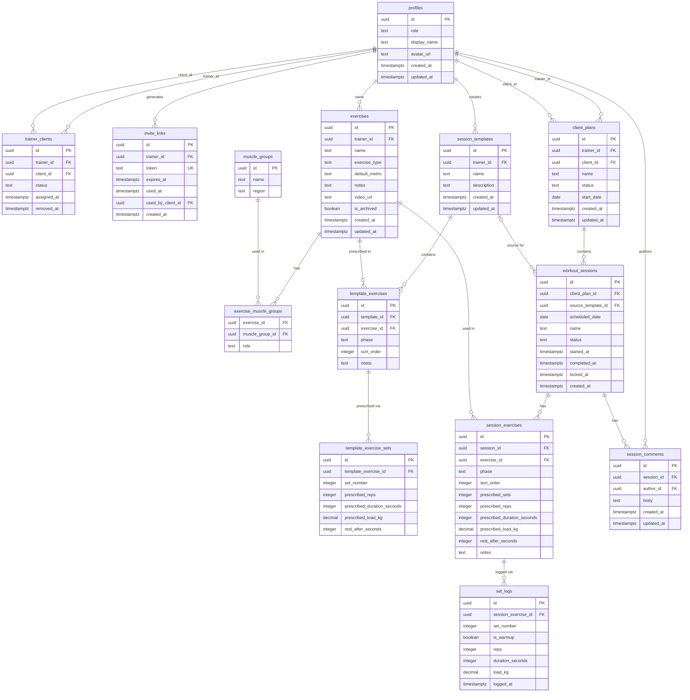

# trAInR — Entity Relationship Design

> Proposed ERD based on `context/foundation/shape-notes.md` and `docs/app-coach-ERD.excalidraw`.
> Tables are split into MVP and Post-MVP tiers. See `docs/trainr-erd.canvas.tsx` in the canvas panel for the visual version with design-decision questions.
> Last updated: 24.05.2026

## Tier Legend

| Tier | Meaning |
|------|---------|
| **T1 — Core** | Must ship: auth, library, templates, calendar, guided workout, logging |
| **T2 — High value** | Ship if time allows: warm-up flags, bidirectional comments, manual completion |
| **T3 — Pressure valve** | Cut first: 24h edit seal, stats |
| **Post-MVP** | Not built at launch — defer migrations |

---

## ERD — MVP Tables (Mermaid)



---

## TypeScript Interfaces — MVP

> All timestamps use ISO 8601 strings. Dates use `YYYY-MM-DD`. Nullable = `| null`.

### Auth & Onboarding (T1)

```typescript
// profiles — unified user table; refs auth.users
type UserRole = 'trainer' | 'client';

interface Profile {
  id: string;            // uuid, PK, references auth.users
  role: UserRole;
  display_name: string;
  avatar_url: string | null;
  created_at: string;
  updated_at: string;
}

// trainer_clients — trainer ↔ client assignment
type TrainerClientStatus = 'active' | 'removed';

interface TrainerClient {
  id: string;
  trainer_id: string;    // FK → profiles
  client_id: string;     // FK → profiles
  status: TrainerClientStatus;
  assigned_at: string;
  removed_at: string | null;
}

// invite_links — one-time invite tokens generated by trainer
interface InviteLink {
  id: string;
  trainer_id: string;            // FK → profiles
  token: string;                 // UNIQUE, URL-safe random string
  expires_at: string | null;     // null = no expiry (not recommended)
  used_at: string | null;
  used_by_client_id: string | null;  // FK → profiles, set on use
  created_at: string;
}
```

### Exercise Library (T1)

```typescript
type ExerciseType = 'strength' | 'cardio' | 'flexibility' | 'other';
type ExerciseMetric = 'reps_weight' | 'time' | 'distance';

// exercises — per-trainer exercise library
interface Exercise {
  id: string;
  trainer_id: string;           // FK → profiles
  name: string;
  exercise_type: ExerciseType;
  default_metric: ExerciseMetric;
  notes: string | null;
  video_url: string | null;     // external link only (YouTube etc.)
  is_archived: boolean;         // archived = hidden from library search, visible in existing sessions
  created_at: string;
  updated_at: string;
}

type MuscleRegion = 'upper_body' | 'lower_body' | 'core' | 'full_body';

// muscle_groups — seeded lookup table
interface MuscleGroup {
  id: string;
  name: string;
  region: MuscleRegion;
}

// exercise_muscle_groups — junction: which muscles an exercise targets
type MuscleRole = 'primary' | 'secondary';

interface ExerciseMuscleGroup {
  exercise_id: string;       // FK → exercises
  muscle_group_id: string;   // FK → muscle_groups
  role: MuscleRole;
}
```

### Session Templates (T1)

```typescript
type ExercisePhase = 'warm_up' | 'main' | 'cool_down';

// session_templates — reusable single-session blueprint
interface SessionTemplate {
  id: string;
  trainer_id: string;         // FK → profiles
  name: string;
  description: string | null;
  created_at: string;
  updated_at: string;
}

// template_exercises — ordered exercises within a template
// Note: session_exercises is a snapshot copy of this, personalizable per session.
interface TemplateExercise {
  id: string;
  template_id: string;                    // FK → session_templates
  exercise_id: string;                    // FK → exercises
  phase: ExercisePhase;
  sort_order: number;
  notes: string | null;
  sets: TemplateExerciseSet[];
}

// template_exercise_sets — per-round prescription for a template exercise
interface TemplateExerciseSet {
  id: string;
  template_exercise_id: string;           // FK → template_exercises
  set_number: number;                     // 1-based
  prescribed_reps: number | null;         // null if timed
  prescribed_duration_seconds: number | null; // null if reps-based
  prescribed_load_kg: number | null;      // null = unspecified, 0 = bodyweight, neg = assisted
  rest_after_seconds: number | null;      // data field; rest timer UI is post-MVP
}
```

### Plans & Sessions (T1)

```typescript
type ClientPlanStatus = 'active' | 'completed' | 'archived';

// client_plans — container: one active plan per client at a time
interface ClientPlan {
  id: string;
  trainer_id: string;   // FK → profiles
  client_id: string;    // FK → profiles
  name: string;
  status: ClientPlanStatus;
  start_date: string | null;  // ISO date, e.g. "2026-05-24"
  created_at: string;
  updated_at: string;
}

type SessionStatus = 'not_started' | 'finished' | 'finished_partially';

// workout_sessions — individual session placed on a calendar day
// Created from a template (source_template_id set) or from scratch (null).
// session_exercises are a snapshot copy of template_exercises at creation time.
interface WorkoutSession {
  id: string;
  client_plan_id: string;             // FK → client_plans
  source_template_id: string | null;  // FK → session_templates; null = from scratch
  scheduled_date: string;             // ISO date, calendar day
  name: string | null;                // from template name or trainer-specified
  status: SessionStatus;
  started_at: string | null;
  completed_at: string | null;
  locked_at: string | null;           // T3: set 24h after first set_log; makes data immutable
  created_at: string;
}

// session_exercises — exercises for this session (snapshot from template, personalizable)
// Mirrors TemplateExercise shape intentionally — this is a denormalized copy.
interface SessionExercise {
  id: string;
  session_id: string;                        // FK → workout_sessions
  exercise_id: string;                       // FK → exercises
  phase: ExercisePhase;
  sort_order: number;
  prescribed_sets: number;
  prescribed_reps: number | null;
  prescribed_duration_seconds: number | null;
  prescribed_load_kg: number | null;
  rest_after_seconds: number | null;
  notes: string | null;
}
```

### Logging & Feedback (T1/T2)

```typescript
// set_logs — one row per logged set (T1 for the table itself; is_warmup is T2)
// Replaces the original ERD's json actualMetrics blob on WorkoutSessionExercise.
// Queryable for previous performance hints (FR-019) and 1RM estimation (FR-025).
interface SetLog {
  id: string;
  session_exercise_id: string;    // FK → session_exercises
  set_number: number;
  // T2: warm-up flag — only working sets (is_warmup=false) count toward hints/stats
  is_warmup: boolean;
  reps: number | null;
  duration_seconds: number | null;  // for timed exercises
  // neg = assisted (resistance bands), 0 = bodyweight, null = not specified
  load_kg: number | null;
  logged_at: string;
}

// session_comments — bidirectional per-session feedback (T2)
interface SessionComment {
  id: string;
  session_id: string;   // FK → workout_sessions
  author_id: string;    // FK → profiles (trainer or client)
  body: string;
  created_at: string;
  updated_at: string | null;
}
```

---

## TypeScript Interfaces — Post-MVP

> Schema-only. Do not implement for MVP. Write Supabase migrations when each feature is built.

```typescript
// goals — client goal tracking (Post-MVP High)
type GoalStatus = 'active' | 'achieved' | 'abandoned';

interface Goal {
  id: string;
  client_id: string;
  title: string;
  target_metric: string;
  target_value: string;
  target_date: string | null;
  status: GoalStatus;
  created_at: string;
}

// progress_entries — body measurements (Post-MVP High)
interface ProgressEntry {
  id: string;
  client_id: string;
  date: string;
  weight_kg: number | null;
  measurements: Record<string, number> | null;  // e.g. { waist: 90, chest: 100 }
  note: string | null;
  created_at: string;
}

// check_ins — weekly trainer-assigned adherence/recovery scores (Post-MVP High)
interface CheckIn {
  id: string;
  client_id: string;
  week_start: string;       // ISO date (Monday)
  adherence_score: number;  // 1–10
  recovery_score: number;   // 1–10
  comment: string | null;
  created_at: string;
}

// exercise_tags — custom color-coded labels (Post-MVP Low)
interface ExerciseTag {
  id: string;
  trainer_id: string;
  name: string;
  color: string;  // hex or named token
}

interface ExerciseTagMap {
  exercise_id: string;
  tag_id: string;
}

// notifications (Post-MVP High)
type NotificationType = 'plan_assigned' | 'session_reminder' | 'check_in_due';

interface Notification {
  id: string;
  recipient_id: string;
  type: NotificationType;
  payload: Record<string, unknown>;
  scheduled_at: string;
  sent_at: string | null;
  created_at: string;
}

// subscriptions — Stripe billing (Post-MVP Low)
interface Subscription {
  id: string;
  trainer_id: string;
  provider: 'stripe';
  external_id: string;
  plan: 'pro' | 'premium';
  status: 'active' | 'cancelled' | 'past_due';
  renewal_at: string;
  created_at: string;
}

// invoices
interface Invoice {
  id: string;
  trainer_id: string;
  subscription_id: string;
  amount_cents: number;
  currency: string;
  status: 'paid' | 'pending' | 'failed';
  issued_at: string;
}

// audit_events — compliance audit log (Post-MVP Low)
interface AuditEvent {
  id: string;
  actor_id: string;
  actor_role: UserRole;
  action: string;
  target_type: string;
  target_id: string;
  created_at: string;
}
```

---

## Key Business Rules (ERD-level constraints)

| Rule | Implementation |
|------|---------------|
| One active plan per client | `UNIQUE (client_id) WHERE status = 'active'` partial index on `client_plans` |
| Trainer can only see own clients | RLS: `trainer_clients.trainer_id = auth.uid()` |
| Client can only see own sessions | RLS: `client_plans.client_id = auth.uid()` |
| Session locked after 24h (T3) | `locked_at IS NOT NULL` → deny `UPDATE` on `set_logs` via RLS check-function |
| Invite token is single-use | `UNIQUE (token)` + `used_at IS NULL` check before registration |
| Session exercises are snapshots | Copying `template_exercises → session_exercises` on session creation; template edits do not retroactively update placed sessions (FR-011) |

---

## Resolved Design Decisions

| # | Question | Decision | Consequence |
|---|----------|----------|-------------|
| Q1 | Phase structure | **A — flat `phase` enum** on each exercise row | No `template_phases` / `session_phases` tables. 2 fewer tables. Phases are `'warm_up' \| 'main' \| 'cool_down'`. |
| Q2 | Set logging | **A — `set_logs` table** (one row per set) | No JSON `actualMetrics` blob. Enables SQL queries for previous performance hints (FR-019) and 1RM (FR-025). |
| Q3 | Client removal data | **B — soft-archive plan, retain data** | On removal: `trainer_clients.status = 'removed'`, `client_plans.status = 'archived'`. Client keeps history; trainer dashboard no longer surfaces the client. |
| Q4 | exercise_tags | **A — drop from MVP** | No `exercise_tags` / `exercise_tag_maps` tables. Trainers filter exercises by `exercise_type` + muscle group only (FR-009). |
| Q5 | invite_link usage | **A — single-use** | Link is consumed on first successful registration (`used_at` set). Subsequent uses rejected. Trainer generates a new link per client. |
